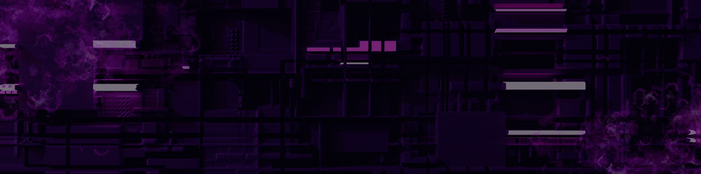

  

<h1 align="center">Ludmila Mansilla</h1>

  Backend Developer · ERP Systems · Problem Solver

  Turning business problems into scalable systems

## About

I am a developer working at the intersection of **technology and business processes**.

My experience comes from building and maintaining ERP systems, where I not only develop features but also **understand how companies operate internally** and translate that into scalable solutions.

I enjoy working on:

* Complex problem solving
* Debugging real production issues
* Designing backend logic
* Improving system performance and workflows

Currently, I am expanding my knowledge towards:

* System architecture
* Scalable backend development
* AI integrations in business environments

---

## What I Do

I work daily with real systems and real problems.

That includes:

* Developing and customizing ERP modules
* Debugging frontend and backend issues
* Analyzing logs and fixing production errors
* Integrating external services through APIs
* Improving business processes through technology

---

## Tech Stack

ERP: Odoo · Backend Logic · API Integrations

---

## How I Work

I focus on building solutions that are not only functional, but also **maintainable and scalable**.

* I prioritize understanding the problem before coding
* I work comfortably in debugging scenarios
* I connect technical solutions with business impact
* I adapt quickly to different systems and environments

---

## Current Focus

* Backend architecture improvement
* AI applied to business processes
* Building more robust and scalable systems

---

## GitHub Activity

  

---

## Contact

